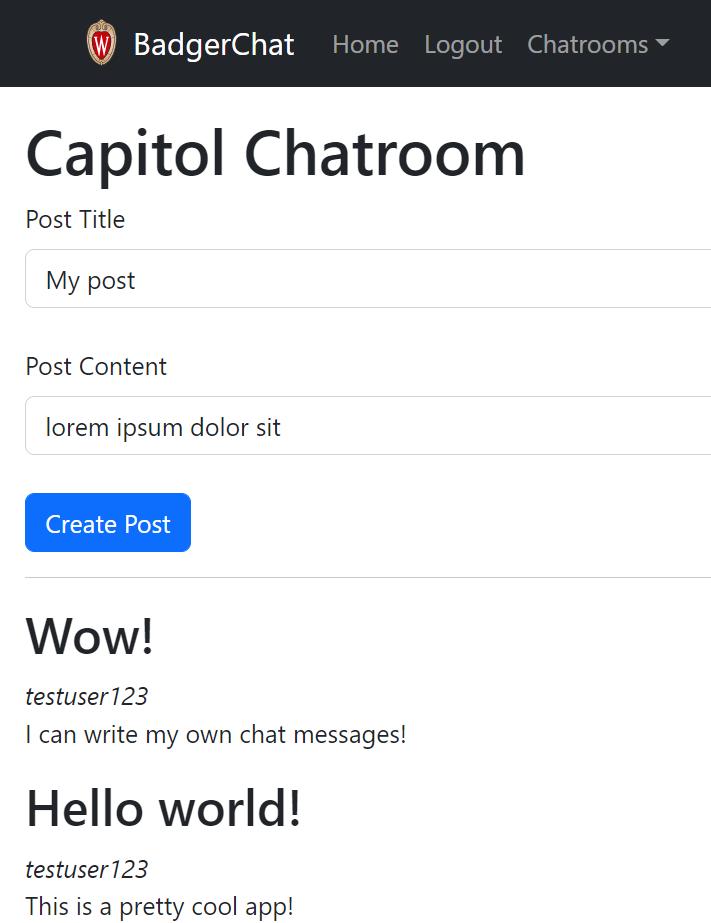
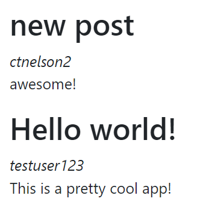
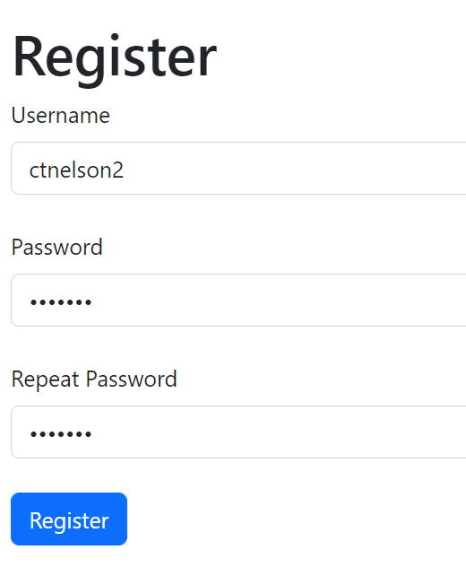
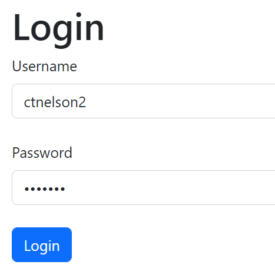
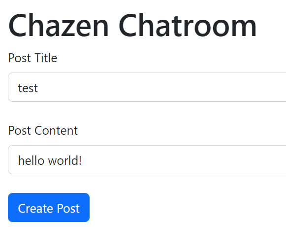
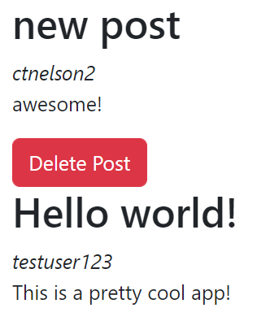

# CS571 Week 05: BadgerChat

Welcome to BadgerChat! For this assignment, you will complete a web application that allows badgers to chat with other badgers via different chatrooms. This assignment works with a *real* API! Please be mindful about what you post, this is a chat server shared by every student in CS571.

Following, you will answer questions related to interaction design.  **Make sure to complete both parts of this assignment.**



## BadgerChat

The starter code provided to you was generated using [create-react-app](https://www.npmjs.com/package/create-react-app). Furthermore, [bootstrap](https://www.npmjs.com/package/bootstrap), [react-bootstrap](https://www.npmjs.com/package/react-bootstrap), and [react-router](https://reactrouter.com/en/main) have already been installed. **You should *not* re-run the create-react-app command**. Instead, in this directory, simply run...

```bash
npm install
npm start
```

Then, in a browser, open `localhost:3000`. You should *not* open index.html in a browser; React works differently than traditional web programming! When you save your changes, they appear in the browser automatically. I recommend using [Visual Studio Code](https://code.visualstudio.com/) to do your development work.

The components you will be working on are located in the `components` folder. Some code has already been done for you, but there is still much work to do.

All data can be retrieved via API calls to `https://www.coletnelson.us/cs571/f22/hw5/api/`. A brief overview of the API is provided below. Please refer to `API_DOCUMENTATION.md` for details.

All routes are relative to `https://www.coletnelson.us/cs571/f22/hw5/api/`

| Method | URL | Purpose | Return Codes |
| --- | --- | --- | --- |
| `GET`| `/chatroom` | Get all chatrooms. | 200, 304 |
| `GET` | `/chatroom/:chatroomName/messages`| Get latest 25 messages for specified chatroom. | 200, 304, 404 |
| `POST` | `/chatroom/:chatroomName/messages` | Posts a message to the specified chatroom. Requires JWT. | 200, 400, 404, 413 |
| `DELETE` | `/chatroom/:chatroomName/messages/:messageId` | Deletes the given message. Requires JWT. | 200, 400, 401, 404 |
| `POST` | `/register` | Registers a user account and returns a JWT. | 200, 400, 401, 409, 413  |
| `POST` | `/login` | Logs a user in, returning a JWT. | 200, 400, 401, 404 |

**When making API calls with a request body, don't forget to include the header `"Content-Type": "application/json"`**

### 1. Display Badger Messages

In `BadgerChatroom.js`, the logic to retrieve `messages` has already been completed for you. Display these messages using the `BadgerMessage` component, which takes three props: `title`, `poster`, and `content`. Don't forget to specify a unique `key`!




### 2. Memoize `BadgerMessage`

Recall the four criteria for using `memo` (Lecture 04, Slide 31)...
 1. Given the same input, renders the same output.
 2. Is rendered often.
 3. Does not change often.
 4. Is of substantial size.

 Besides being a bit small, `BadgerMessage` is the perfect candidate to be a memoized component! Use `memo` to memoize the `BadgerMessage` component. Because this is an optimization task, nothing should visually change. Instead, the `BadgerMessage` component should now only be re-rendered when its `props` change.

 ### 3. Allow Registration

In `BadgerRegister.js`, create a form using **controlled input components** that allows a user to create a username, password, and confirm their password. Upon clicking a "Register" button, a `POST` should be performed to create the user via the API.

*Before* performing the API call you should handle the following cases...
 - If the user does not enter a username or password, display an `alert` saying "You must provide both a username and password!"
 - If the user enters a password and password confirmation that do not match, display an `alert` saying "Your passwords do not match!"

 *After* receiving a response from the API, you should handle the following cases...
  - If the username is already taken, display an `alert` saying "That username has already been taken!"

You do not need to handle any other user input failures. You should hardcode your `refCode` in the fetch to the API; this should *not* come from user input.

Upon receiving a successful `200` response, make sure to set the auth token for the application by calling...

```javascript
setAuthToken(YOUR_FETCHED_JWT)
```

... where `YOUR_FETCHED_JWT` is the `token` returned by the API.

**Note:** For a more fluid user experience, you can use react-router's [useNavigate]("https://www.geeksforgeeks.org/reactjs-usenavigate-hook/") hook to redirect the user to the home page after a successful registration. This is just a suggestion, not a requirement!




### 4. Allow Login

In `BadgerLogin.js`, create a form using **uncontrolled input components** that allows a user to enter their username and password. Upon clicking a "Login" button, a `POST` should be performed to authenticate the user via the API.

*Before* performing the API call you should handle the following cases...
 - If the user does not enter a username or password, display an `alert` saying "You must provide both a username and password!"

 *After* receiving a response from the API, you should handle the following cases...
  - If the username does not exist, display an `alert` saying "Incorrect username!"
  - If the password is incorrect, display an `alert` saying "Incorrect password!"

You do not need to handle any other user input failures.

Upon receiving a successful `200` response, make sure to set the auth token for the application by calling...

```javascript
setAuthToken(YOUR_FETCHED_JWT)
```

... where `YOUR_FETCHED_JWT` is the `token` returned by the API.

**Note:** For a more fluid user experience, you can use react-router's [useNavigate]("https://www.geeksforgeeks.org/reactjs-usenavigate-hook/") hook to redirect the user to the home page after a successful login. This is just a suggestion, not a requirement!




### 5. Create Posts

In `BadgerChatroom.js`, allow an authenticated user to create posts. If the user is not yet authenticated (i.e. if the user does not have an `authToken` yet), display a message that says "You must be logged in to post!" Otherwise, the user should be able to make a post through a form with a post title, post content, and create post button. You may choose whether you want to use **controlled** or **uncontrolled** input components. Note that whether or not a user is authenticated, they should be able to see the most recent messages for their chatroom.

*Before* performing the API call you should handle the following cases...
 - If the user does not enter a title or content, display an `alert` saying "You must provide both a title and content!"

*After* performing the API call you should `alert` the user that they have "Successfully posted!" and you should call `loadMessages()` to reload the latest messages.

You do not need to handle any other user input failures.

Don't forget this is an authenticated endpoint! It requires a valid `Authorization: Bearer :JWT` header where `:JWT` is the provided `authToken`.




### 6. (Optional, Extra Credit) Delete Posts

For 0.5 points of extra credit, add the option for a user to delete their posts. A red "Delete" button should be shown for each post that a user owns but not for other posts. How you choose to implement this is up to you (e.g. you made need to modify the `BadgerAuthContext` to store the `username` as well as the `authToken`, or create a seperate `BadgerUserContext`).

*After* performing the API call you should `alert` the user that they have "Successfully deleted the post!" and you should call `loadMessages()` to reload the latest messages.

Don't forget this is an authenticated endpoint! It requires a valid `Authorization: Bearer :JWT` header where `:JWT` is the provided `authToken`.

**Warning:** This task is more cumbersome than it may seem, make sure you have time and a plan before beginning it!



___

## Interaction Design

The questions below will ask you about the design of the BadgerChat website that you had just implemented. For each question, please write a response grounded in content from the "Interaction Design" lecture or other reputable sources.

1. What model (or combination of models) best describes the navigation of your site? Justify your response.

INSERT YOUR RESPONSE HERE.

2. Does there exist an escape hatch in this web application? If so, where/what is it? If not, what would be an appropriate escape hatch?

INSERT YOUR RESPONSE HERE.

3. Does there exist a hero image in this web application? If so, where/what is it? If not, using aspects of visual design, design a hero image and paste a picture of it below. Describe where this hero image would be placed and what it would accomplish.

INSERT YOUR RESPONSE HERE.

___

## Bug Bounty Program
This program is neither for credit or extra credit; this is simply for fun! :) I am offering a $25 bug bounty in the form of an Amazon gift card for each security vulnerability discovered and disclosed for this HW's API.

 Please wait until 1 week *after* the deadline of this assignment prior to doing any testing. Denial of service attacks are strictly prohibited, but other vulnerabilities such as injection, directory browsing, information leakage, insufficient authentication, insufficient cryptography, etc. are fair game. The project is [open source](https://github.com/CS571-F22/hw5-api), good luck!